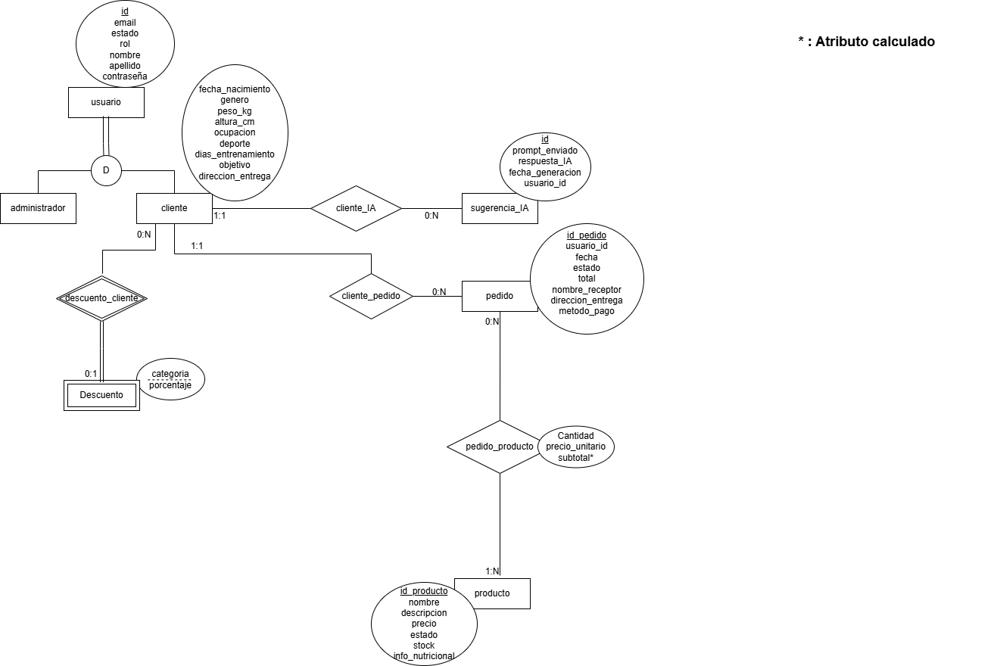

# Propuesta E-commerce de Suplementos Nutricionales con IA

## Grupo.

### Integrantes

* 54007 \- De Giorgi, Juan Ignacio  
* 54457 \- Favaretto, Bianca  
* 53752 \- Nicora Manassero, Sol  
* 54006 \- Scaldini, Angelo

### 

### Repositorios

* \[frontend app: React\]  
* \[backend app: JavaScript\]

## 

## Tema

### Descripción

El sistema se trata de un sitio web especializado en la comercialización de suplementos para el deporte, que incorpora un mecanismo de sugerencias adaptadas mediante tecnología de Inteligencia Artificial. Tal programa facilita gestionar un inventario de artículos con datos nutricionales y permite a los clientes registrados obtener sugerencias adecuadas a su perfil y a sus programas de ejercicio.

### 

### Modelo

## Alcance Funcional

### Alcance Mínimo

Regularidad:

| Req | Detalle |
| :---- | :---- |
| CRUD simple | 1\. CRUD administrador.   2\. CRUD cliente.   3\. CRUD producto.   4\. CRUD pedido. 
| CRUD dependiente | 1. CRUD pedido_producto {depende de} CRUD pedido y CRUD producto.   2. CRUD sugerencia_IA {depende de} CRUD cliente. |
| Listado \+ detalle | 1\. Listado de producto filtrado por precio: muestra nombre, descripción, precio y info\_nutricional.   2\. Listado de pedido filtrado por estado: muestra id\\\_pedido, id\\\_usuario, fecha, estado y total. |
| CUU/Epic | CUU1. Consultar IA y armar carrito con sugerencia. 
CUU2. Realizar pedido. |

Adicionales para Aprobación

| Req | Detalle |
| :---- | :---- |
| CRUD | 1. CRUD administrador.   2. CRUD cliente.   3. CRUD producto.   4. CRUD pedido.   5. CRUD pedido_producto.   6. CRUD sugerencia_IA.   7. CRUD descuento. |
| CUU/Epic | CUU1. Registrar y actualizar un perfil de cliente.   CUU2. Actualizar stock producto.   CUU3. Eliminar cliente.   CUU4. Eliminar producto. |

### Alcance Adicional Voluntario

| Req | Detalle |
| :---- | :---- |
| Listados | 1\. Listado pedidos del cliente por rango de fecha: muestra id\_pedido, fecha, nombre\_producto, cantidad\_producto.  |
| CUU/Epic | CUU1. Despachar pedido. |
| Otros | 1\. Envío email informando despacho de pedido.   2\. Vista de la información nutricional de productos.   3\. Indicador de stock del producto. |

